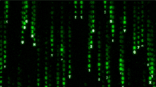

# Matrix Rain Study

Click [here](https://lettucegoblin.github.io/matrix-rain-study/) to view the project.

## Description

This project generates random streams of characters and displays them in the browser. The streams can include numbers, English alphabets, and Kanji characters. The streams are displayed in a container element specified by a CSS selector.

